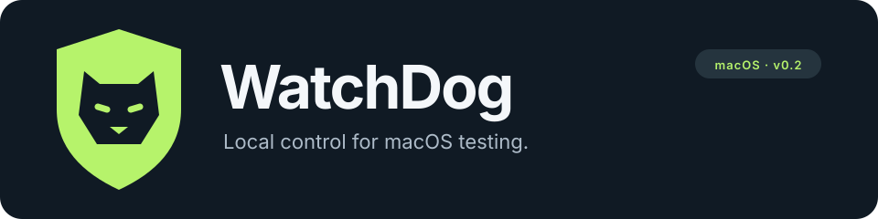

# WatchDog

Reversible **local Jamf control** for enrolled macOS test machines. WatchDog can block the Jamf Pro framework, Self Service, and App Installers on the Mac. MDM enrollment stays intact. Jamf Connect blocking is optional and off by default.

> **Experimental.** This is a test utility, not a security boundary. It interrupts inventory, policies, Self Service, and App Installers that depend on local binaries. It does not freeze the disk. Network On/Yeet can deny check-in and Jamf cloud fetches; Yeet also disrupts Apple push. Polling has a CPU cost. It is not kernel execution denial.

**0.4.0** · macOS 14+ · independent of Jamf · [changelog](CHANGELOG.md) · [architecture](docs/architecture.md) · [security](SECURITY.md)

## Quick start

Requires a Mac with administrator access, Python 3.10+, and Xcode or the Command Line Tools.

```sh
git clone https://github.com/admin-TSK/WatchDog.git
cd WatchDog
./install.sh
./scripts/status.sh
```

Remove it and restore recorded settings:

```sh
./uninstall.sh
```

`./install.sh` builds the native monitor and menu bar app, then prompts for administrator authentication. The guard starts at boot. The menu bar app starts for the signed-in user and opens at login. Binaries are ad hoc signed locally; they are not notarized.

If WatchDog or the older “Jamf Test Blocker” is already installed, uninstall that copy first. A second install is refused.

```sh
WATCHDOG_PYTHON=/absolute/path/to/python3 ./install.sh
```

Optional flags, all off by default at install. The Shields tab can later toggle the same controls without reinstalling:

```sh
WATCHDOG_STICKY_BLOCK=1 WATCHDOG_MATCH_SIGNATURE=1 ./install.sh
WATCHDOG_BLOCK_CONNECT=1 ./install.sh   # can lock users out of Connect logins
WATCHDOG_NETWORK=on ./install.sh        # outbound Jamf/MDM filter; Yeet also blocks APNs
```

Read the Connect warning in [SECURITY.md](SECURITY.md) before enabling that flag.

## Scope

| In | Out |
| --- | --- |
| Local Jamf Pro framework, including `jamf`, `jamfHelper`, and Management Action | MDM enrollment and configuration profiles |
| Self Service and Jamf App Installers | Jamf Protect |
| Optional Jamf Connect app/agents (`WATCHDOG_BLOCK_CONNECT=1`) | Login-window plugins and `authorizationdb` |
| Optional outbound Network filter (Off / On / Yeet) | `jamfcheck`, Jamf Compliance Editor, AppAutoPatch |
| Reversible undo record of modes, flags, launch jobs, and WatchDog PF rules | Absolute coverage against VPN, proxies, or future custom endpoints |

Uninstall restores what WatchDog recorded. Root, MDM, or an updater can reverse it while it is installed. Details: [architecture](docs/architecture.md).

## Menu bar

**WatchDog.app** installs with the guard. The shield in the menu bar opens a **Shields** tab and an **Activity** tab.

Shields shows one tile per control. Toggle any layer independently:

| Shield | Default | Effect |
| --- | --- | --- |
| Permissions | On | Strip execute bits on matched Jamf binaries |
| Launch jobs | On | Disable and unload matching launch jobs |
| Process monitor | On | Pause and kill matching processes |
| Sticky block | Off | `UF_IMMUTABLE` after stripping execute |
| Signatures | Off | Match Jamf code-signing IDs in the monitor |
| Jamf Connect | Off | Optional Connect app/agents; confirm before enabling |
| Network | Off | Off / On / Yeet outbound filter. On denies Jamf/MDM destinations. Yeet also blocks APNs (confirm). |

Turning a core shield off reverses that layer. Enabling Connect can lock the login window on Macs that use it; WatchDog still never rewrites `authorizationdb`.

The Activity tab reports confirmed WatchDog actions, an unread badge, optional notifications, login startup, and a JSON export. It does not list every `EACCES` from stripped execute bits, Jamf policy names, or MDM commands. The feed keeps the latest 100 events.

Quit the menu bar to close the interface only. Protection keeps running.

## How it works

| Layer | Action | Interval |
| --- | --- | --- |
| Launch jobs | Disable and unload matching Jamf jobs | ~2 s |
| Permissions | Strip execute bits at known paths, including replacements | ~100 ms |
| Discovery | Find new executables under Jamf support folders and apps | ~2 s |
| Process monitor | Pause and kill matching processes, children, and group helpers | ~50 ms |
| Network | Outbound PF deny to discovered Jamf/MDM hosts (On) plus APNs/enrollment (Yeet) | On change, then ~60 s DNS refresh |
| Recovery | Record original modes, flags, and job states | Before each first change |
| Supervision | Restart the monitor; start the guard at boot | launchd + guard |

Intervals are targets. A process can act first. [Architecture and limits](docs/architecture.md).

## Requirements

- macOS 14 or later, Apple Silicon or Intel
- Python 3.10 or later (standard library only; WatchDog does not bundle Python)
- Xcode Command Line Tools or Xcode, to compile the monitor
- Administrator access

Prefer `/usr/bin/python3` when it is 3.10+. The installer stores a fallback list; `run-guard` uses the first candidate that still exists so a Homebrew or framework upgrade is less likely to leave the LaunchDaemon dead after reboot.

## Installed files

| Item | Location |
| --- | --- |
| Guard | `local.watchdog.guard` · `/Library/Application Support/WatchDog/` |
| LaunchDaemon | `/Library/LaunchDaemons/local.watchdog.guard.plist` |
| Guard log | `/var/log/watchdog.log` |
| Menu bar app | `/Applications/WatchDog.app` |
| Event reader | `local.watchdog.events` · `/Library/Application Support/WatchDog Monitor/` |
| Activity feed | `/Library/Application Support/WatchDog Status/events.json` |
| Shield requests | `/Library/Application Support/WatchDog Status/requests/` |
| Event log | `/var/log/watchdog-events.log` |
| Log rotation | `/etc/newsyslog.d/local.watchdog.conf` |
| Login item | `~/Library/LaunchAgents/local.watchdog.menubar.plist` |

The clone can move after install. The service runs from the copy under `/Library`. Changing source does not update an installed service.

`./uninstall.sh` also recognizes the original Jamf Test Blocker. Records marked `original_override_unverified` restore using the recorded fallback. [Restoration](docs/architecture.md#restoration).

## Development

```sh
./scripts/build.sh   # universal monitor → build/watchdog
./scripts/test.sh    # isolated tests; no administrator access
./scripts/status.sh  # inspect a live install
```

Tests use temporary fixtures and mocked `launchctl`. They never install WatchDog or change the live Jamf framework. CI runs the same checks on macOS. [Testing](docs/testing.md) · [contributing](CONTRIBUTING.md)

```text
WatchDog/
├── install.sh      # build and install
├── uninstall.sh    # restore and remove
├── src/            # guard, event reader, C monitor, Swift menu bar
├── scripts/        # build, test, status
├── tests/
├── assets/
├── docs/
└── .github/
```

`.gitignore` excludes build products, logs, runtime state, and `.local/` machine notes. This repository has no credentials or server config.

## License

No open-source license has been selected. Cloning this private repository does not grant a right to reuse or redistribute it. See [LICENSE-NOTICE.md](LICENSE-NOTICE.md).
