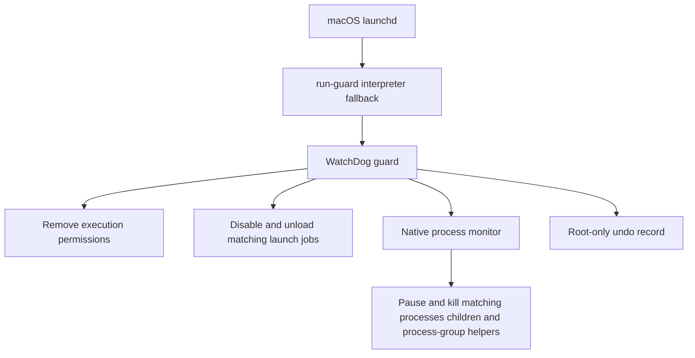

# Architecture and boundaries

WatchDog has two runtime processes. The launchd service starts `run-guard`, which execs `guard.py` with the first remaining Python 3.10+ interpreter from the install-time fallback list. The guard launches and supervises the native `watchdog` monitor.

## Menu bar event flow

A separate root LaunchDaemon runs `event_bridge.py` through `run-events`. It reads the existing guard log and undo record, checks the guard and its child monitor, and publishes a small JSON snapshot once per second. If the guard is not running, it attempts one `launchctl bootstrap` per minute. `./install.sh` installs this companion with the guard.

The event reader's code and cursor state are private to root. Its public directory is root-owned mode `0755`, and the snapshot is mode `0644`. Other local users can read the same limited activity feed: event categories, framework executable names or job labels, timestamps, PIDs, and counts. It exposes no original file paths, enrollment information, credentials, or raw error details.

The menu bar cannot write the guard's undo record or the activity feed. It can change runtime shields by dropping `{id, enabled}` JSON into `/Library/Application Support/WatchDog Status/requests/` (mode `1777`), or `{id: "network", mode: "off"|"on"|"yeet"}` for the outbound filter. The root event reader applies only known shield keys into the guard's `shields.json`. Any local account that can write that drop folder can toggle WatchDog's local controls. The feed itself stays read-only.

Only recognized log messages become events. Existing history is imported from at most the last 256 KiB of log data. Up to 100 events remain visible. Native process-stop lines without timestamps are marked “Earlier” when imported; new untimestamped lines use the time the reader observed them. Cursor and event state survive restarts, and log rotation is recognized by file identity or truncation. Historical events are not replayed as new notifications. Logs are rotated by `/etc/newsyslog.d/local.watchdog.conf`.

The guard and activity reader use macOS libproc metadata queries for session discovery and child-process checks, avoiding system-wide `ps` subprocesses. Health checks inspect all tracked executable paths plus the known Jamf binaries. Historical `ps` session-scan timeouts are labeled as skipped session checks; actual control failures retain their error category. Feed upgrades preserve event IDs, timestamps, counts, and the log cursor. A successful native session lookup emits a recovery marker once at startup and after a failed lookup. Only earlier session-timeout warnings receive a resolution timestamp; unrelated failures and later warnings remain unresolved. The app keeps resolved entries in expandable history and exports, excluding them from unread badges and notifications.

The app treats a snapshot older than 12 seconds as unavailable, rather than showing a stale healthy state. Optional notifications require the user's macOS permission. The companion does not detect kernel-level execution denials, retrieve policy names, or observe MDM commands. It reports what WatchDog's own logs confirm.

## Matching

`src/targets.py` is the single source of truth. The native monitor compiles the same path, prefix, exclusion, and signing lists. Isolated tests compare the two.

The permission guard inspects `/usr/local/jamf/bin/jamf`, `/usr/local/bin/jamf`, `jamfAgent`, and currently executable regular files under `/Library/Application Support/JAMF/` (including `bin/jamfHelper` and `bin/Management Action`), Self Service apps including Self Service+, and `/Library/Application Support/JamfAppInstallers/`. It skips non-executable data, symlinks (`O_NOFOLLOW`), WatchDog's own files, Jamf Protect, `jamfcheck`, Jamf Compliance Editor, AppAutoPatch, and login-window `SecurityAgentPlugins`. It does not modify file contents, certificates, enrollment profiles, or package receipts.

Launch-job matching uses `com.jamfsoftware.task.*`, `com.jamf.management.*`, Self Service, and App Installers labels. It is not a blanket `com.jamf*` match and never selects Jamf Protect. It scans `/Library/LaunchDaemons`, `/Library/LaunchAgents`, and each login user’s `~/Library/LaunchAgents` (no symlink follow). The two standard system job labels are disabled proactively even when their plist files are absent.

The monitor matches those same paths. Optionally (`WATCHDOG_MATCH_SIGNATURE=1`) it also matches Jamf-authored code-signing identifiers, excluding Protect and non-Jamf lookalikes. It pauses matching roots, refreshes the process table, marks observable descendants by PPID and by process group when the matched process is that group's leader, and kills the selected processes. Process start times are compared before signalling to reduce PID-reuse risk. Neither a command-line mention nor an unrelated executable named `jamf` outside the matched paths is sufficient.

### Jamf Connect (opt-in)

Connect blocking is off unless `WATCHDOG_BLOCK_CONNECT=1` at install. When enabled, WatchDog may disable `com.jamf.connect*` launch jobs and strip execute bits on Connect app binaries and `authchanger`. It never rewrites `authorizationdb` and never touches login-window SecurityAgentPlugins.

If this Mac uses Jamf Connect at the login window, enabling this flag can lock users out until WatchDog is uninstalled. Uninstall restores recorded execute bits and re-enables recorded launch jobs. Use a disposable test Mac with an alternative admin login.

## What remains outside the boundary

- MDM enrollment and configuration profiles. Network On denies Jamf check-in HTTPS (discovered host and port), Jamf cloud/JCDS, and Apple enrollment/profile-fetch HTTPS. Yeet also denies published APNs ranges. Installed profiles keep applying locally. VPN/proxy can bypass. A loaded PF rule is not a confirmed deny. The Remote Assist wildcard cannot be expanded into PF addresses; that expected gap is recorded as `partial` and is not treated as a protection error. The PF enable token from `pfctl -E` is stored only in the root undo record and passed to `pfctl -X` on Off; WatchDog never calls bare `-X`.
- Root processes that restore permissions, replace binaries, remove WatchDog, or flush PF.
- Jamf Protect.
- Non-Jamf tools whose names contain “jamf” (`jamfcheck`, Jamf Compliance Editor, AppAutoPatch scripts).
- Login-window SecurityAgentPlugins and `authorizationdb`.
- Work already delegated to independent system services.
- Actions completed before the next polling cycle.

Copied binaries are missed unless signature matching is enabled. Descendants that left both the parent tree and the process group before observation can still escape a given pass.

The native monitor checks processes every 50 ms by default. The guard checks permissions at known executable paths every 100 ms, including files replaced at those paths. A separate background thread discovers new component paths and checks launch jobs approximately every two seconds. Slow session discovery or launchctl commands cannot hold up the permission loop. Both threads serialize changes to the undo record. All intervals are best-effort polling, configurable in `installation.json`. Continuous monitoring has a CPU cost. This is a test control, not a kernel execution-denial mechanism or a write sandbox.

Optional sticky block (`WATCHDOG_STICKY_BLOCK=1` or the Shields tile) sets `UF_IMMUTABLE` after stripping execute bits so a naive `chmod +x` cannot restore execution until the flag is cleared. Original flags are recorded in the undo record and restored on uninstall. Turning the Permissions, Launch jobs, or Process monitor shield off reverses that layer while WatchDog remains installed.

Jamf documents the distinction between its local binary and MDM in [Jamf Pro framework fundamentals](https://www.jamf.com/blog/fundamentals-jamf-pro-framework-jnuc2022/), and lists its local components in [Components Installed on Managed Computers](https://learn.jamf.com/r/en-US/jamf-pro-documentation-11.28.0/Components_Installed_on_Managed_Computers).

## Restoration

Before a first change, the guard writes an undo record using a temporary file, flushes it, then replaces the state file. The root-owned installation directory is mode `0700`; state is mode `0600`. Current records are version 2 and may include original `st_flags`. Version 1 records still restore: missing flags are treated as “do not change flags.”

File modes are saved by path. If a file is replaced during a test, restoration applies that path’s original recorded mode to the replacement. Missing files are reported and skipped. Unexpected symlinks are refused. Sticky-block restoration clears `UF_IMMUTABLE` (or restores the recorded flags) before reapplying the mode.

Launchd restoration restores the recorded effective enabled/disabled state. It may leave an explicit override where none existed before. Jobs that were loaded before the test are reloaded when their original plist remains available. A GUI session that no longer exists can require a later restoration attempt after login. Killed processes are not reconstructed.

The earliest prototype used a parser that did not recognize macOS’s `enabled`/`disabled` wording. Its affected records carry `original_override_unverified`. On restoration, the guard prints a notice and uses the recorded fallback; it cannot recover an unrecorded historical override. Current code accepts both `true`/`false` and `enabled`/`disabled` output.

Legacy installations are detected through their installed plist and guard path. The new installer refuses to run alongside them. Repository rebranding alone does not migrate, stop, or rename a live service.
