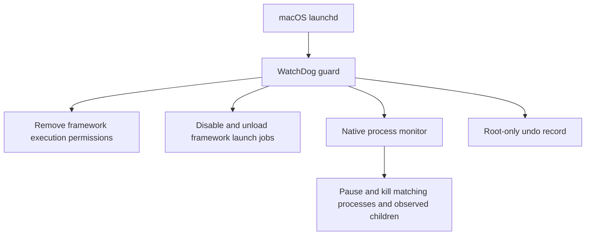

# Architecture and boundaries

WatchDog has two runtime processes. The launchd service starts `guard.py` using the Python interpreter selected at installation. The guard launches and supervises the native `watchdog` monitor.

## Menu bar event flow

A separate root LaunchDaemon runs `event_bridge.py`. It reads the existing guard log and undo record, checks the guard and its child monitor, and publishes a small JSON snapshot once per second. The existing guard does not need to be restarted to add this companion.

The event reader's code and cursor state are private to root. Its public directory is root-owned mode `0755`, and the snapshot is mode `0644`. Other local users can read the same limited activity feed: event categories, framework executable names or job labels, timestamps, PIDs, and counts. It exposes no original file paths, enrollment information, credentials, or raw error details. The menu bar app runs as the signed-in user and cannot change the guard through this feed.

Only recognized log messages become events. Existing history is imported from at most the last 256 KiB of log data. Up to 100 events remain visible. Native process-stop lines without timestamps are marked “Earlier” when imported; new untimestamped lines use the time the reader observed them. Cursor and event state survive restarts, and log rotation is recognized by file identity or truncation. Historical events are not replayed as new notifications.

The guard and activity reader use macOS libproc metadata queries for session discovery and child-process checks, avoiding system-wide `ps` subprocesses. Health checks inspect all tracked executable paths. Historical `ps` session-scan timeouts are labeled as skipped session checks; actual control failures retain their error category. Feed upgrades preserve event IDs, timestamps, counts, and the log cursor. A successful native session lookup emits a recovery marker once at startup and after a failed lookup. Only earlier session-timeout warnings receive a resolution timestamp; unrelated failures and later warnings remain unresolved. The app keeps resolved entries in expandable history and exports, excluding them from unread badges and notifications.

The app treats a snapshot older than 12 seconds as unavailable, rather than showing a stale healthy state. Optional notifications require the user's macOS permission. The companion does not detect kernel-level execution denials, retrieve policy names, or observe MDM commands. It reports what WatchDog's own logs confirm.

## Matching

The permission guard inspects the main Jamf binary, the legacy `jamfAgent` when present, and executables declared in component `Info.plist` files beneath `/Library/Application Support/JAMF/Jamf.app`. It does not modify file contents, certificates, enrollment profiles, or package receipts.

Launch-job matching uses the `com.jamfsoftware.task.*` labels and an explicit set of Jamf Pro management labels. It scans the system LaunchDaemons folder and the shared LaunchAgents folder for active GUI sessions. The two standard system job labels are disabled proactively even when their plist files are absent.

The monitor matches known executable paths and executable paths inside Jamf.app. It pauses matching roots, refreshes the process table, identifies observable descendants, and kills the selected processes. Process start times are compared before signalling to reduce PID-reuse risk. Neither a command-line mention nor an unrelated executable named `jamf` outside the matched paths is sufficient.

## What remains outside the boundary

- MDM enrollment, configuration profiles, and the independent MDM command channel.
- Root processes that restore permissions, replace the framework, or remove WatchDog.
- Executables copied to other paths.
- Descendants that detached or were reparented before observation.
- Work already delegated to independent system services.
- Actions completed before the next polling cycle.
- Jamf Protect, Jamf Connect, and system-wide installer or APNs services.

The native monitor checks processes every 100 ms. The guard checks permissions at known executable paths every 200 ms, including files replaced at those paths. A separate background thread discovers new component paths and checks launch jobs approximately every two seconds. Slow session discovery or launchctl commands cannot hold up the permission loop. Both threads serialize changes to the undo record. All intervals are best-effort polling. Continuous monitoring has a CPU cost. This is a test control, not a kernel execution-denial mechanism or a write sandbox.

Jamf documents the distinction between its local binary and MDM in [Jamf Pro framework fundamentals](https://www.jamf.com/blog/fundamentals-jamf-pro-framework-jnuc2022/), and lists its local components in [Components Installed on Managed Computers](https://learn.jamf.com/r/en-US/jamf-pro-documentation-11.28.0/Components_Installed_on_Managed_Computers).

## Restoration

Before a first change, the guard writes an undo record using a temporary file, flushes it, then replaces the state file. The root-owned installation directory is mode `0700`; state is mode `0600`.

File modes are saved by path. If a file is replaced during a test, restoration applies that path’s original recorded mode to the replacement. Missing files are reported and skipped. Unexpected symlinks are refused.

Launchd restoration restores the recorded effective enabled/disabled state. It may leave an explicit override where none existed before. Jobs that were loaded before the test are reloaded when their original plist remains available. A GUI session that no longer exists can require a later restoration attempt after login. Killed processes are not reconstructed.

The earliest prototype used a parser that did not recognize macOS’s `enabled`/`disabled` wording. Its affected records carry `original_override_unverified`. On restoration, the guard prints a notice and uses the recorded fallback; it cannot recover an unrecorded historical override. Current code accepts both `true`/`false` and `enabled`/`disabled` output.

Legacy installations are detected through their installed plist and guard path. The new installer refuses to run alongside them. Repository rebranding alone does not migrate, stop, or rename a live service.
