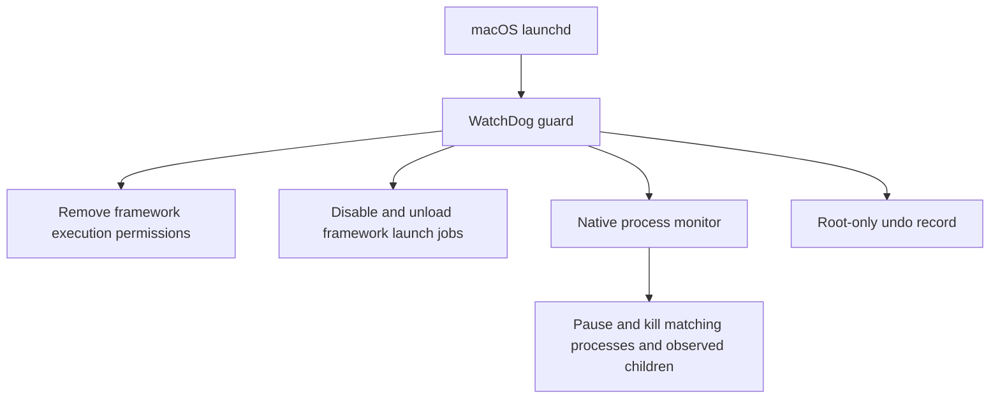

# Architecture and boundaries

WatchDog has two runtime processes. The launchd service starts `guard.py` using the Python interpreter selected at installation. The guard launches and supervises the native `watchdog` monitor.

## Matching

The permission guard inspects the main Jamf binary, the legacy `jamfAgent` when present, and executables declared in component `Info.plist` files beneath `/Library/Application Support/JAMF/Jamf.app`. It does not modify file contents, certificates, enrollment profiles, or package receipts.

Launch-job matching uses the `com.jamfsoftware.task.*` labels and an explicit set of Jamf Pro management labels. It scans the system LaunchDaemons folder and the shared LaunchAgents folder for active GUI sessions. The two standard system job labels are disabled proactively even when their plist files are absent.

The monitor matches known executable paths and executable paths inside Jamf.app. It pauses matching roots, refreshes the process table, identifies observable descendants, and kills the selected processes. Process start times are compared before signalling to reduce PID-reuse risk. Neither a command-line mention nor an unrelated executable named `jamf` outside the matched paths is sufficient.

## What remains outside the boundary

- MDM enrollment, configuration profiles, and the independent MDM command channel.
- Root processes that restore permissions, replace the framework, or remove WatchDog.
- Executables copied to other paths.
- Descendants that detached or were reparented before observation.
- Work already delegated to independent system services.
- Actions completed before the next polling cycle.
- Jamf Protect, Jamf Connect, and system-wide installer or APNs services.

The monitor’s 100 ms interval and the guard’s approximately two-second interval are best-effort polling. Continuous monitoring has a CPU cost. This is a test control, not a kernel execution-denial mechanism or a write sandbox.

Jamf documents the distinction between its local binary and MDM in [Jamf Pro framework fundamentals](https://www.jamf.com/blog/fundamentals-jamf-pro-framework-jnuc2022/), and lists its local components in [Components Installed on Managed Computers](https://learn.jamf.com/r/en-US/jamf-pro-documentation-11.28.0/Components_Installed_on_Managed_Computers).

## Restoration

Before a first change, the guard writes an undo record using a temporary file, flushes it, then replaces the state file. The root-owned installation directory is mode `0700`; state is mode `0600`.

File modes are saved by path. If a file is replaced during a test, restoration applies that path’s original recorded mode to the replacement. Missing files are reported and skipped. Unexpected symlinks are refused.

Launchd restoration restores the recorded effective enabled/disabled state. It may leave an explicit override where none existed before. Jobs that were loaded before the test are reloaded when their original plist remains available. A GUI session that no longer exists can require a later restoration attempt after login. Killed processes are not reconstructed.

The earliest prototype used a parser that did not recognize macOS’s `enabled`/`disabled` wording. Its affected records carry `original_override_unverified`. On restoration, the guard prints a notice and uses the recorded fallback; it cannot recover an unrecorded historical override. Current code accepts both `true`/`false` and `enabled`/`disabled` output.

Legacy installations are detected through their installed plist and guard path. The new installer refuses to run alongside them. Repository rebranding alone does not migrate, stop, or rename a live service.
